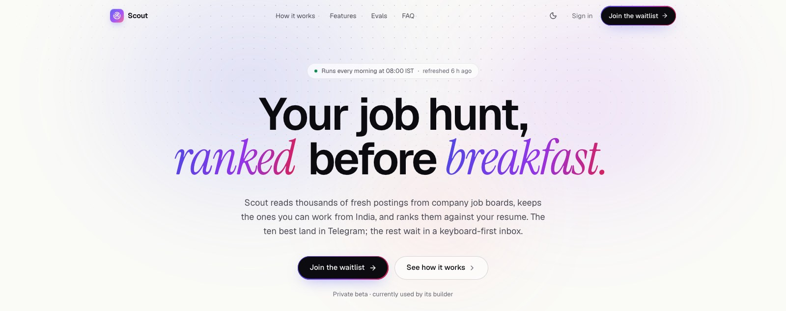

<div align="center">
  
  <br /><br />

  
  
  
  
  

  <h3>A job-hunt copilot that reads the source, not the job boards.</h3>

  <a href="https://scout-chi-sooty.vercel.app/"><strong>Live site →</strong></a>
</div>

---

Every morning Scout pulls fresh postings straight from ~150 companies' own job boards and a few public feeds. It removes duplicates, drops anything you can't actually work from India, and ranks the rest against your resume with a three-stage retrieval + LLM pipeline. The ten best land in Telegram; everything else waits in a keyboard-first dashboard.

It runs on free tiers: a GitHub Actions cron, Postgres + pgvector, Vercel and Telegram. The LLM only ever sees the ~60 jobs the vector stage thinks are worth scoring, which is what keeps it inside a free-tier budget.

## Contents

1. [Architecture](#architecture)
2. [Measured](#measured)
3. [How ranking works](#how-ranking-works)
4. [Features](#features)
5. [Project structure](#project-structure)
6. [Run locally](#run-locally)
7. [Deploy](#deploy)
8. [Waitlist and owner-only mode](#waitlist-and-owner-only-mode)
9. [Testing and evals](#testing-and-evals)
10. [Trade-offs](#trade-offs)

## Architecture

```
GitHub Actions cron (08:00 IST)
  └─ scout run
       fetch ─► normalize ─► upsert ─► embed ─► dedup ─► hard filters ─► cosine top-K ─► score ─► rank ─► notify
       (async, 7 sources)  (idempotent) (bge-small) (fuzzy+vector) (incl. India-workable)  (Jev → Gemini → Groq → local → heuristic)
                                   │
                                   ├─► insights: change tracking · salary estimates · company stats · skill gaps · reminders
                                   ▼
                       Postgres + pgvector  ◄──── Next.js 15 app (Vercel)
                                   ▲                landing · waitlist · today · job · tracker · search · company · label · health · settings
                                   └──── Telegram webhook (👍 👎 ✅ feedback)
```

## Measured

Real runs against the live sources — not estimates.

| | |
|---|---|
| Sources | Greenhouse, Ashby, Lever, Arbeitnow, HN Who's Hiring, RemoteOK, Remotive (+ Adzuna with a key) |
| Companies tracked | 144, every board slug probed live |
| Jobs per run | ~15,300 fetched (15,277 on 30 Sep 2026) |
| Duplicates collapsed | 3,161 in that run |
| Workable from India | 884 open roles after the location rules |
| Sent to the LLM | ≤ 60 per run, via the cosine pre-filter |
| First run | 587 s (493 s is one-time CPU embedding) |
| Incremental run | ~95–125 s, 0 re-scores on unchanged postings |
| Tests | 128 pytest · 24 Playwright (app) · 19 Playwright (auth + waitlist) |

Precision@10, recall@50, ECE, p50 latency and $/1k jobs per scorer come from `scout eval` once the label set is built in `/label`. CI blocks a change that drops precision@10 by more than 5 points.

## How ranking works

1. **Hard filters** — title keywords, excluded titles and companies, seniority, experience ceiling, posting age ≤ 45 days, and location. "Remote" only passes if it's genuinely workable from India: an Indian city, a truly global role, or plain "Remote" whose description mentions India or IST. "Remote (US only)" is rejected.
2. **Vector pre-filter** — cosine similarity between your resume and each posting (`bge-small-en-v1.5`, 384-d, HNSW with iterative scan so filtered queries don't starve the index). Keep the top 60, plus tier-1 companies.
3. **Typed LLM scoring** — Jev (a non-generative decision model on OpenRouter) answers fixed questions: fit 0–10, seniority match, should-apply probability. On error, 429 or schema-invalid output the chain falls through to Gemini, Groq, a local Ollama model, then a keyword heuristic. Scores are cached on `(job, profile_version, content_hash)`, and a daily cost cap switches to free scorers.
4. **Rank** — `final = w · [fit_prob, embed_sim, tier, freshness]`. Weights are refit weekly from your feedback by logistic regression and kept only if they beat the old ones on the held-out split. Isotonic calibration turns raw scores into an "82% fit" that actually means 82%.

## Features

**Daily inbox**
- **Today** — Superhuman-style triage: J/K to move, S save, A apply, undo toasts, Top / Maybe / All tabs, filters
- **Briefing strip** — new matches since yesterday, and the one skill that would unlock the most extra matches ("Learn Go → +131")
- **Telegram digest** at 08:00 IST with one-tap 👍 👎 ✅ feedback

**Each job**
- Score breakdown, matched vs. missing skills, and duplicates collapsed from other boards
- **Change tracking** — every posting keeps its version history; opened / changed / closed / reopened / salary-changed events
- **Salary estimate** from comparable roles when the posting doesn't say
- **Tailored resume** and **interview prep pack** for the role, plus a cover-note generator

**Around the hunt**
- **Tracker** — Huntr-style kanban with drag and drop, funnel rates and follow-up reminders
- **Search** — hybrid fulltext + vector search fused with reciprocal rank fusion
- **Company pages** — hiring velocity, open/opened/closed roles, top skills, locations, remote share
- **Label** — Y/N labeling toward a 200-job eval set with a deterministic dev/test split
- **Health** — runs, per-stage timings, cost, per-source errors, eval table, reliability chart
- **Bring your own key** — paste a Gemini key in Settings; it stays in the browser and is used only for your own requests
- ⌘K palette, `?` shortcut sheet, light/dark, mobile layout

## Project structure

```
pipeline/                 Python 3.11 — the daily job
  scout/
    sources/              ATS + job-board adapters (async httpx, retries, ETags)
    normalize/ dedup/     canonical location/remote/experience, fuzzy + vector dedup
    filters/ embed/       hard filters (incl. India-workable), bge-small embeddings
    scoring/ rank/        typed scorer chain, cost guard, calibrated ranking
    insights.py salary/ tracking.py reminders.py   derived data for the app
    evals/ notify/        eval harness, Telegram + console notifiers
    cli.py                `scout run | eval | tune | profile | companies | seed-demo …`
  alembic/  tests/
web/                      Next.js 15 + TypeScript + Tailwind + Drizzle
  app/                    landing, waitlist, signin, (app)/today|job|tracker|search|company|label|health|settings, api/
  components/ lib/
companies.yaml            the company board list
.github/workflows/        ci · daily · eval · weekly-tune
```

## Run locally

```bash
createdb scout
cd pipeline && python3.11 -m venv venv && venv/bin/pip install -e '.[dev]'
venv/bin/alembic upgrade head
venv/bin/scout companies sync
venv/bin/scout profile set examples/resume.md --prefs examples/prefs.yaml
venv/bin/scout run

cd ../web && npm install && cp .env.example .env.local && npm run dev
```

No keys are needed to try it: the heuristic scorer and a console notifier stand in. Add `OPENROUTER_API_KEY` (Jev), `GEMINI_API_KEY`, `GROQ_API_KEY`, and `TELEGRAM_BOT_TOKEN` + `TELEGRAM_CHAT_ID` to turn on the real paths.

Demo data for any database: `scout seed-demo --database-url <url>`.

## Deploy

1. **Database** — any Postgres with pgvector (production runs on Supabase's free tier). Run `alembic upgrade head` against it with its `DATABASE_URL`. Use the session pooler (port 5432) for the pipeline and the transaction pooler (port 6543) for Vercel.
2. **GitHub Actions** — add secrets `DATABASE_URL`, `GEMINI_API_KEY` and optionally `GROQ_API_KEY`, `OPENROUTER_API_KEY`, `TELEGRAM_BOT_TOKEN`, `TELEGRAM_CHAT_ID`, `ADZUNA_APP_ID`/`ADZUNA_APP_KEY`. `daily.yml` runs at 08:00 IST and can be triggered by hand.
3. **Vercel** — import `web/`, set the variables from `web/.env.example`, then register the Telegram webhook:
   ```bash
   curl "https://api.telegram.org/bot$TOKEN/setWebhook?url=https://<app>/api/telegram&secret_token=$TELEGRAM_WEBHOOK_SECRET"
   ```
4. **Public demo (optional)** — a second database seeded with `scout seed-demo`, deployed with `DEMO_MODE=1` for a read-only app with no sign-in.

## Waitlist and owner-only mode

Scout is in private beta: the dashboard is owner-only and everyone else sees a waitlist.

- **Owner access** — with `DEMO_MODE` off, every app and API route (except `/api/auth`, the secret-checked `/api/telegram` webhook and the public waitlist) requires the owner: the credentials user in `SCOUT_OWNER_EMAIL` / `SCOUT_OWNER_PASSWORD_HASH` (generate with `npm run hash-password`), or a GitHub login in `AUTH_ALLOWED_GITHUB`. The owner signs in from the quiet "Sign in" link at `/signin`.
- **Waitlist** — visitors join with just an email and consent, then get an optional 5-step survey: search stage; roles, experience and locations; biggest pains; tools used today; and how likely they'd pay ₹299/month, with an optional reason. Each step saves as soon as it's answered (HMAC-signed token), returning visitors resume where they stopped, and finishing the survey moves you up a day.
- **Referrals** — every signup gets a `/?ref=<code>` link; position ranks by join time minus a day per referral.
- **Privacy and abuse** — IPs are stored only as `sha256(ip + AUTH_SECRET)`; signups are rate-limited (5 per 10 minutes per IP) with a honeypot; `/waitlist/leave` lets anyone delete their entry.
- **Admin** — `/admin/waitlist` shows signups per day, survey completion, pay-likelihood distribution, top pains and tools, a hot-leads filter, and a CSV export of every field.
- Set `RESEND_API_KEY` and `EMAIL_FROM` to send confirmation emails (optional).

## Testing and evals

```bash
make test                                   # pytest — sources, dedup, filters, scoring chain, tracking, insights
cd web && npx playwright test                # app flows
cd web && npm run test:e2e:auth              # sign-in, owner gating, waitlist + survey
make eval                                    # precision@10, recall@50, ECE, latency, cost per scorer
```

Fixture-based source tests mean the suite never hits a live job board. The scorer chain is tested with mocked 429s and invalid output to prove each fallback records the right model.

Workflows: `ci.yml` (pytest + web lint/build), `daily.yml` (the pipeline), `eval.yml` (on scoring changes), `weekly-tune.yml` (refit weights, commit metrics — this also keeps the cron alive).

## Trade-offs

- **Cron, not a server** — one daily batch fits the job and costs nothing; the web app is serverless and only reads and writes rows.
- **Embeddings before the LLM** — scoring 15k postings with an LLM every day is wasteful; the vector stage cuts it to ~60 calls.
- **Public ATS APIs only** — no LinkedIn or Naukri scraping. Fewer jobs, but legal and stable.
- **Aggressive dedup** — the same title in the same city at one company collapses to one card, which hides repeated requisitions by design.
- **Storage** — the full corpus is ~400 MB, most of it postings you can't work from India. Slimming those to metadata only is the next step before the free tier fills up.
- **At 100× scale** — move embedding to a GPU batch job, partition `jobs` by source, and replace the cron with a queue per source.
